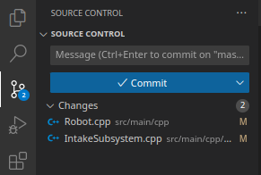
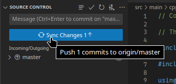
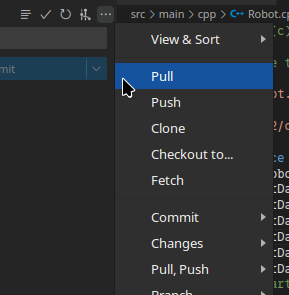

# How to Use Git

## In the terminal
You can open a new terminal in VS Code by using `Ctrl + Shift + ~`

- `git status` View the status of any changes made to the code
- `git add <filename>` Stage a file to be committed *(`git add .` adds all the modified files)*
- `git commit -m "<commit message>"` Commit the staged files to be pushed to remote
- `git push` To push the code to a remote repository *(`git push -u origin <name of the branch>` to push the code to a specific branch)*

## VS Code Source Control
You can also directly commit code in VS Code. You can view the status of any changed files in the Source Control panel

Stage files by pressing the small plus icon next to each file, add a commit message, and press `Commit`.

Finally push your changes to remote using the `Sync Changes` button.

Additionally, you can pull changes from remote by opening the menu and selecting `Pull`

