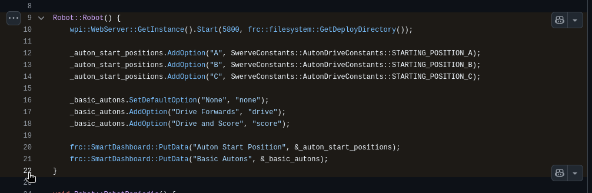

# Important Skills
This document is a list of specific important programming skills and techniques, for use in future years of robot code. Refer back to this list when you need to find how we did something in previous years, and see an example for how to implement something specific.

## Table of Contents
- [Button Box](#button-box)
- [Robot Config](#robot-config)
- [State Machines](#state-machines)

## Skills
### Button Box
- **Tokay 2025**
    - Button Box OI functions [source](https://github.com/FRC-Team3484/X25_RobotCode/blob/09dda19890cdd19e2e039991c6f7a0a076bc50f4/src/main/cpp/OI.cpp#L40-L75) | [header](https://github.com/FRC-Team3484/X25_RobotCode/blob/09dda19890cdd19e2e039991c6f7a0a076bc50f4/src/main/include/OI.h#L41-L64)
    - Button Box OI constants [header](https://github.com/FRC-Team3484/X25_RobotCode/blob/09dda19890cdd19e2e039991c6f7a0a076bc50f4/src/main/include/Constants.h#L258-L280)
    - Button Box code [ino file](https://github.com/FRC-Team3484/X25_RobotCode/blob/09dda19890cdd19e2e039991c6f7a0a076bc50f4/buttonbox/buttonbox.ino)
        - Our button boxes have run on an Arduino microcontroller, this is the code file that we had to flash to the device using the Arduino IDE

### Robot Config
- **Tokay 2025**
    - `Config.h` can be used to enable and disable different parts of the robot
    - Example Drivetrain and vision config [header](https://github.com/FRC-Team3484/X25_RobotCode/blob/09dda19890cdd19e2e039991c6f7a0a076bc50f4/src/main/include/Config.h#L1-L7) | [usage](https://github.com/FRC-Team3484/X25_RobotCode/blob/09dda19890cdd19e2e039991c6f7a0a076bc50f4/src/main/include/Robot.h#L81-L92)

### State Machines
- **Tokay 2025**
    - Teleop driver state machine [source](https://github.com/FRC-Team3484/X25_RobotCode/blob/09dda19890cdd19e2e039991c6f7a0a076bc50f4/src/main/cpp/Robot.cpp#L93-L133) | [header](https://github.com/FRC-Team3484/X25_RobotCode/blob/09dda19890cdd19e2e039991c6f7a0a076bc50f4/src/main/include/Robot.h#L206-L213)
    - Teleop intake algae state machine [source](https://github.com/FRC-Team3484/X25_RobotCode/blob/09dda19890cdd19e2e039991c6f7a0a076bc50f4/src/main/cpp/commands/teleop/TeleopIntakeAlgaeCommand.cpp#L24-L86) | [header](https://github.com/FRC-Team3484/X25_RobotCode/blob/09dda19890cdd19e2e039991c6f7a0a076bc50f4/src/main/include/commands/teleop/TeleopIntakeAlgaeCommand.h#L50-L51)

## Adding to This List
If we learn a new specific way of doing things, it should be added to this list. Match the existing format as best you can. Attempt to keep each specific skill in alphabetical order, and don't forget to add your skill to the table of contents.

You can copy links to a specific set of lines in a file on GitHub.

First, click on the line number for the first line you'd like to select

Then, **Shift+Click** the end of the range of the lines

Finally, select the three dots, and press **Copy Permalink**

You could also use a VSCode extension like [GitHub Linker](https://marketplace.visualstudio.com/items?itemName=gimenete.github-linker) to make this process easier.